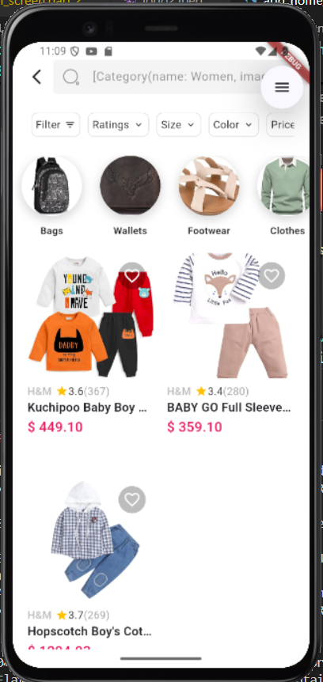

# 🛍️ SwiftMart – Smart Shopping, Simplified

**SwiftMart** is a full-featured **e-commerce Flutter application** designed with a clean, scalable architecture. It supports **role-based login for Admin and Users**, real-time data syncing via Firebase, and secure payments with Razorpay. Whether you're an admin managing products or a user browsing and buying items, SwiftMart offers a seamless experience with persistent cart, order tracking, and payment history.

---

##  Features at a Glance

###  Role-Based Authentication
- Admin and User have separate login flows and dashboards
- Firebase Authentication with persistent sessions

###  Admin Panel
-  Add/Delete/Filter Products
-  View all orders from users in real-time
-  Upload product images (Cloudinary or Firebase Storage)
-  Monitor product availability and inventory

###  User Functionality
- Browse categories & detailed product pages
-  Mark products as favorites
-  Add to cart with quantity, size, and color selection
- Place orders with instant confirmation
- View order history and current status

###  Secure Payments
-  Razorpay payment gateway integration
- Load wallet balance (optional)
-  View payment summaries after checkout
-  Multiple payment options supported: **PayPal**, **MasterCard**, UPI, and Cards

### Smart Backend with Firebase
- Firestore stores all users, products, carts, orders
- Data persists across sessions
- Real-time listeners update UI instantly

###  Tech Stack & Tools
-  Flutter & Dart
-  Firebase (Auth, Firestore, Storage)
-  Cloudinary (optional) for product image hosting
-  Razorpay API for secure payments
-  Riverpod for state management
-  CachedNetworkImage for performance-optimized UI
- Material Design & responsive layout

---

## Screenshots

> ## Screenshots

### 1. User Flow & Payment Screenshots

|  |  |  |  |
|---|---|---|---|
| Add Fund | Add Payment Method | Add Payment Method (Alt) | Payment Method |

|  |  |  |  |
|---|---|---|---|
| Payment Process | Payment Process (Alt) | Payment Success | Payment Type |

|  |  |  |  |
|---|---|---|---|
| Payment Screen | Order Screen | Order Success | Order Details |

### 2. Admin & Product Management Screenshots

|  |  |  |  |
|---|---|---|---|
| Admin Add Product | Admin View Orders | Product Category | Product Detail |

|  |  |  |  |
|---|---|---|---|
| Product Cart | Product Cart (Alt 1) | Product Cart (Alt 2) | Product Order |

|  |  |  |  |
|---|---|---|---|
| Favorite Product | Favorite Product (Alt) | Login | Register |

|  |  |  |  |
|---|---|---|---|
| Register (Alt) | User Home | User Home (Alt) | User Info |


---


## 🧪 How to Run the Project

1. **Clone the repository**  
   ```bash
   git clone https://github.com/PremmChand/swiftmart.git
   cd swiftmart


👤 Developed by Premm Chand


💡 This project is a personal initiative to learn and showcase real-world Flutter, Firebase, and e-commerce integrations. 

⭐ If you found this project helpful or inspiring, don’t forget to Star it on GitHub!