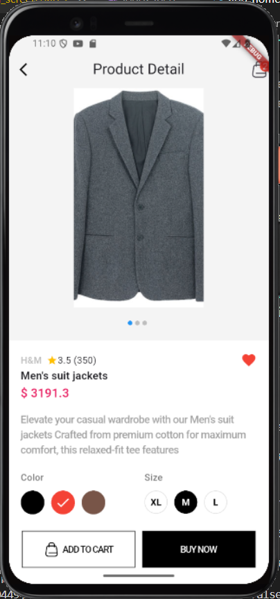
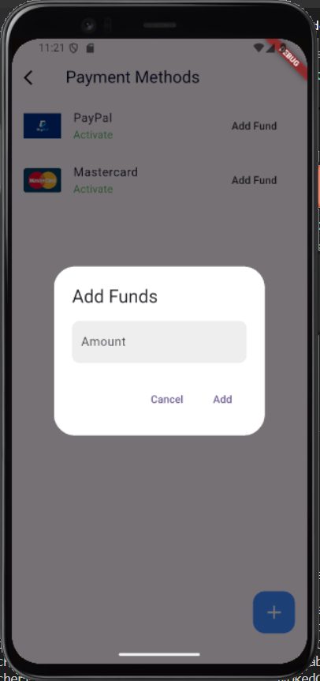
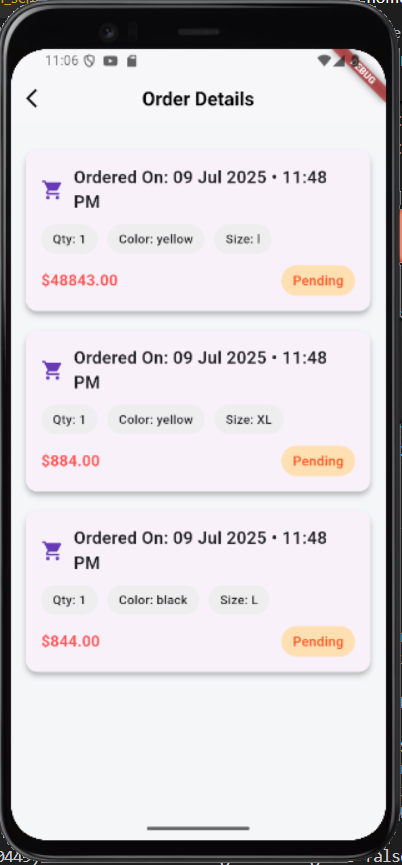

# 🛍️ SwiftMart – Smart Shopping, Simplified

**SwiftMart** is a full-featured **e-commerce Flutter application** designed with a clean, scalable architecture. It supports **role-based login for Admin and Users**, real-time data syncing via Firebase, and secure payments with Razorpay. Whether you're an admin managing products or a user browsing and buying items, SwiftMart offers a seamless experience with persistent cart, order tracking, and payment history.

---

## 🚀 Features at a Glance

### 🔐 Role-Based Authentication
- Admin and User have separate login flows and dashboards
- Firebase Authentication with persistent sessions

### 🧑‍💼 Admin Panel
- Add/Delete/Filter Products
- View all orders from users in real-time
- Upload product images (Cloudinary or Firebase Storage)
- Monitor product availability and inventory

### 🛒 User Functionality
- Browse categories & detailed product pages
- Mark products as favorites
- Add to cart with quantity, size, and color selection
- Place orders with instant confirmation
- View order history and current status

### 💳 Secure Payments
- Razorpay payment gateway integration
- Load wallet balance (optional)
- View payment summaries after checkout
- Multiple payment options supported: **PayPal**, **MasterCard**, UPI, and Cards

### 🧠 Smart Backend with Firebase
- Firestore stores all users, products, carts, orders
- Data persists across sessions
- Real-time listeners update UI instantly

### 🛠️ Tech Stack & Tools
- Flutter & Dart
- Firebase (Auth, Firestore, Storage)
- Cloudinary (optional) for product image hosting
- Razorpay API for secure payments
- Riverpod for state management
- CachedNetworkImage for performance-optimized UI
- Material Design & responsive layout

---

## 📸 Screenshots

### 1️⃣ User Authentication & Dashboard

|  |  |  |
|---|---|---|
| Login | Register | Register (Alt) |

|  |  |  |
|---|---|---|
| User Home | User Home (Alt) | User Info |

---

### 2️⃣ Admin Panel

|  |  |
|---|---|
| Admin – Add Product | Admin – View Orders |

---

### 3️⃣ User Features – Product, Favorites & Cart

|  |  |  |
|---|---|---|
| Product Category | Product Detail | Product Detail (Alt) |

|  |  |
|---|---|
| Favorite Product | Favorite Product (Alt) |

|  |  |  |
|---|---|---|
| Product Cart | Product Cart (Alt 1) | Product Cart (Alt 2) |

---

### 4️⃣ Payments Flow

|  |  |  |  |
|---|---|---|---|
| Add Fund | Add Payment Method | Add Payment Method (Alt) | Payment Method |

|  |  |  |  |
|---|---|---|---|
| Payment Type | Payment Process | Payment Process (Alt) | Payment Summary |

|  |  |
|---|---|
| Payment Success | Order Success |


---

### 5️⃣ Order Placement & Details

|  |  |  |  |
|---|---|---|---|
| Product Order | Order List | Order Details | Order Detail (Alt) |


---

## 🛠️ Getting Started

1. **Clone the repository**  
   ```bash
   git clone https://github.com/PremmChand/swiftmart.git
   cd swiftmart

👤 Developed by Premm Chand

💡 This project is a personal initiative to learn and showcase real-world Flutter, Firebase, and e-commerce integrations.

⭐ If you found this project helpful or inspiring, don’t forget to Star it on GitHub!